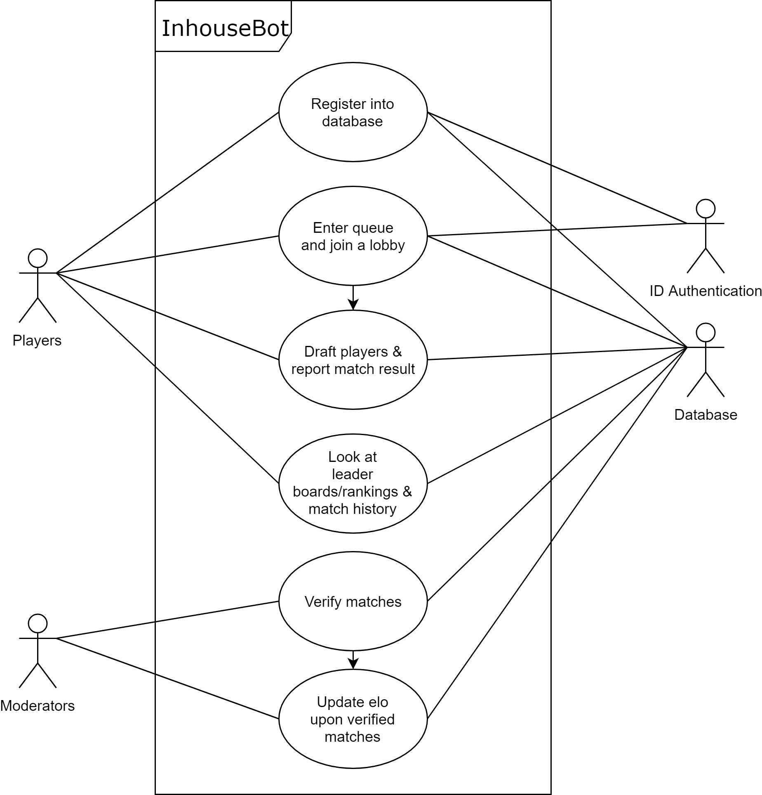

# Inhouse Bot

## Project Abstract

Inhouse Bot is a discord bot. It's primary function is to be an inhouse ranking system intended for League of Legends (can be easily altered for other games). The bot will support various commands asynchronously with multiple users at once. It will track and maintain the progress of each lobby and will report the winners and losers upon match completion. The system will use an elo rating system. It will also include a verification system to ensure all registered players have a legitimate account from League of Legends. Having this inhouse bot will enable Discord community servers to track and reward their most active members.

## Project Relevance

The proposal is linked to the educational goals of this class because it provides practical experience with several fields of software development. This project will utilize Git/Github, version control, testing, parallel computing or asynchronous programming, debugging, access to databases and object oriented design. These goals are all important as they help build and introduce, if not yet known, the programmers to those fields and develop them further. This will as well involve learning new APIs such as from Discord and Riot Games similar to how in the industry engineers have to learn new technologies all the time.

## Conceptual Design

The project is a stand-alone project. I plan on creating the bot from the ground up. I will implement the database to store player information, the commands to invoke the bot in discord, the asynchronous nature of the bot, matchmaking system, draft captain system, leaderboards/ranking, match history and the elo rating system. The code will be based on asynchronous programming and object oriented programming. It will be coded in python.

## Background

https://github.com/BasilPanda/inhousebot.py

## Required Resources
- Group members
- Hardware and software resource required
